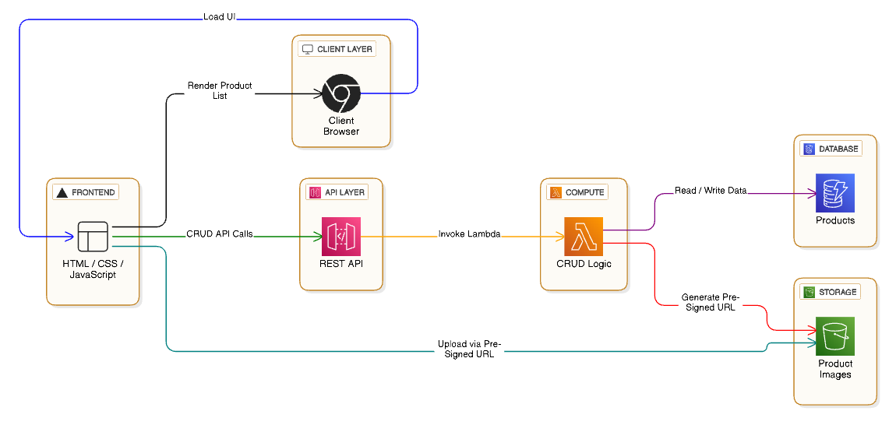

# Architecture

The system follows a clean, modular microservice architecture leveraging AWS managed services.

## Workflow Overview
1. User interacts with the Vercel-hosted frontend.
2. Frontend sends API requests to API Gateway.
3. API Gateway invokes Lambda functions.
4. Lambda reads/writes product data in DynamoDB.
5. For image uploads:
   - Lambda generates pre-signed S3 URLs.
   - Frontend uploads images directly to S3.
6. Upon AWS unavailability, frontend switches to Demo Mode.

## Architecture Diagram 

This design is fully serverless, scalable, and free-to-run after decommissioning.

---